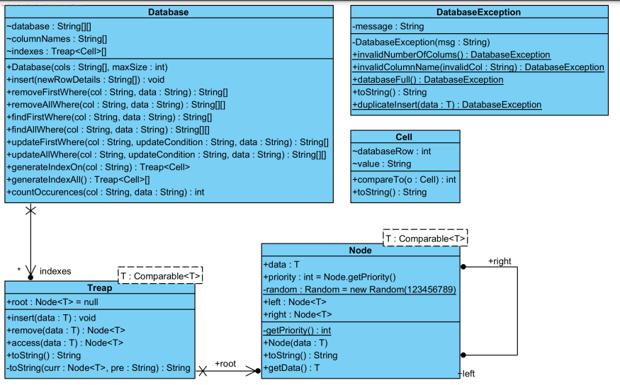
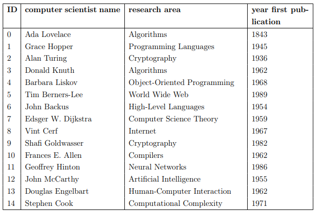

---
# DATABASE SIMULATION USING A TREAP FOR INDEXING
---
## BINARY TREE VARIATIONS

- ### INTRODUCTION:
    - #### `Self-Organizing Data Structures`
        - A `self-organizing` data structure is a data structure that has some `rule(s)` or `algorithm` attached to the `access` method for each `node` in the data structure.
        - These rule(s) or algorithms `result in changing` the structure or order of the data structure in an attempt to `speed up` the problem of `searching` for data in the data structure `[AW05]`.
        - The access method is a function or function that searches for the data in the data structure and `returns` the data.
        - The main goal of a self-organizing data structure is to `move away` from a `lookup time` of `O(n)` and towards an instant lookup time of `O(1)`. Examples of self-organizing data structures are `self-organizing lists`, `binary trees` and `m-way trees`.
    - #### `Treap`
        - A treap is a variation of a `randomized` search tree algorithm. Treaps differ from standard binary search trees in the following ways:
            - ##### `Node`:
                - Nodes in a standard binary search tree `only` has a data member which stores the `data` of the node.
                - This differs from treaps in the sense that nodes has an `additional` member which is the `priority` of the node.
            - ##### `Properties`:
                - Standard Binary Search trees only maintain the `property` that data that is `smaller` than the current node's data is part of the `left` `subtree` of the node and data that is `greater` than the current node's data are part of the `right` `subtree` of the node.
                - With treaps, an additional property is introduced. The `max heap property`. This property states that the data of node n is `greater or equal` to either of its `children` `[ASSS86]`.
                - Treaps combine the idea of `Heaps` (where the aforementioned property originated from) and `Binary SearchTrees`.  Thus Treaps maintain the `max heap` property of heaps as well as the `efficient search` property of `Binary Search Trees`.
                - The max heap property is applied to the `priority` of each treap node and the binary search is applied to the `data` of each treap node.
        - Treaps `assign` `priorities randomly` to each node which originates from the `randomized` search tree algorithm. This allows for the `average` case of the treap to be `perfectly balanced` `[SA96]`.
        - The `standard` implementation of a treap is to use an `array` but for this implementation I will be implementing the treap as a `tree`.
    - #### `Self-organizing Treaps`
        - This implementation will also put a `twist` on the standard treap in the sense that we add the idea of `self-organizing` data structures on top of the treap.
        - Thus with each `access` of a node, the `priority` of the node will `increase` and a `rotation` may be required to `maintain` the max heap property.
    - #### `Database`
        - A database is usually a `collection` of `rows` that are somehow `related` to each other.
        - It is possible to have `unstructured` databases `(e.g. NoSQL)` databases but for this implementation, I will be implementing a structured database.
        - ##### `Structured Database`
            - A structured database refers to a database that has a `strict` structure that `cannot` be changed or will result in `possibly undefined behavior`.
            - A database's structure is described by a `set of properties` the data has which will be called `columns`. Rows in the database are a `grouping` of data that has all the properties and that are closely related to each other.
            - Thus each row's properties are somehow closely related to each other. Usually, databases have `multiple` tables to `model` the `real world` more accurately.
            - Due to `complexity`, this implementation will only be implementing a `single-tabled` database. Databases usually have the following set of operations
                - `Insert`
                - `Update`
                - `Delete`
                - `Search`
                - And I will also implement these operations.
    - #### `Indexing`
        - Searching is one of the most important features of a database. A `naive` approach is to `linearly search` through the database for a `record` or possibly `multiple records`.
        - But this implementation will try to `optimize` this naive approach.
        - In databases especially relational databases is to `index` columns that are used to search through often.
        - Indexing implies `building` an `external` `data structure` that will increase the `efficiency` of the `searching` algorithm when searching for data. Usually, this is accomplished by using a `B+` or `B*` tree.
        - This implementation will attempt to use a different data structure: `Self Organizing Treaps`. This will hopefully increase the efficiency of the searching algorithm over the linear searching algorithm
- ### RESOURCES AND REFERENCES:
    - [Relational Databases](https://www.oracle.com/za/database/what-is-a-relational-database/)
    - [Treap]()
    - [Indexing]()
    - [Self-Organizing Data Structures]()
    - [Exceptions](https://en.wikipedia.org/wiki/Error_hiding)
    - [ASSS86] Michael D Atkinson, J-R Sack, Nicola Santoro, and Thomas Strothotte. Min-max heaps and generalized priority queues. `Communications of the ACM`, 29(10):996–1000, 1986.
    - [AW05] Susanne Albers and Jeffery Westbrook. Self-organizing data structures. Online Algorithms: `The state of the art`, pages 13–51, 2005.
    - [SA96] Raimund Seidel and Cecilia R Aragon. `Randomized search trees`. Algorithmica, 16(4-5):464–497, 1996
- ### UML DIAGRAM:
    

- ### EXAMPLE SQL QUERIES AND EQUIVALENT JAVA COODE:
    - ### `Example Table Structure`
        
    - ### `Example 1`
        - ##### `Java`
            - ```java
                Database(["ID","Computer Scientist Name","Research Area","Year of First Publication"], 15)
                ```
        - ##### `SQL Query`
            - ```sql
                CREATE DATABASE IF NOT EXISTS computer_scientists;
                USE computer_scientists;
                CREATE TABLE IF NOT EXISTS computer_scientists (
                    id INT NOT NULL AUTO_INCREMENT PRIMARY KEY,
                    name VARCHAR(255) NOT NULL,
                    research_area VARCHAR(255) NOT NULL,
                    year_first_publication INT NOT NULL
                );
                ```
    - ### `Example 2`
        - ##### `Java`
            - ```java
                insert(["16","Edmund Clarke","Model Checking","1982"])
                ```
        - ##### `SQL Query`
            - ```sql
                INSERT INTO computer_scientists (id, name, research_area, year_first_publication)
                VALUES (16, 'Edmund␣Clarke', 'Model␣Checking', 1982);
                ```
    - ### `Example 3`
        - ##### `Java`
            - ```java
                removeFirstWhere("research area", "Algorithms")
                ```
        - ##### `SQL Query`
            - ```sql
                DELETE FROM computer_scientists WHERE research_area = 'Algorithms' LIMIT 1;
                ```
    - ### `Example 4`
        - ##### `Java`
            - ```java
                removeAllWhere("research area","Algorithms")
                ```
        - ##### `SQL Query`
            - ```sql
                DELETE FROM computer_scientists WHERE research_area = ’Algorithms ’;
                ```
    - ### `Example 5`
        - ##### `Java`
            - ```java
                findFirstWhere("year first publication", "1962")
                ```
        - ##### `SQL Query`
            - ```sql
                SELECT * FROM computer_scientists WHERE year_first_publication = 1962 LIMIT 1;
                ```
    - ### `Example 6`
        - ##### `Java`
            - ```java
                findAllWhere("year first publication", "1962")
                ```
        - ##### `SQL Query`
            - ```sql
                SELECT * FROM computer_scientists WHERE year_first_publication = 1962;
                ```
    - ### `Example 7`
        - ##### `Java`
            - ```java
                updateFirstWhere("research area","Artificial Intelligence", "AI")
                ```
        - ##### `SQL Query`
            - ```sql
                UPDATE computer_scientists SET research_area = 'AI' WHERE research_area= 'Artificial␣Intelligence' LIMIT  1;
                ```
    - ### `Example 8`
        - ##### `Java`
            - ```java
                updateAllWhere("research area","Artificial Intelligence", "AI")
                ```
        - ##### `SQL Query`
            - ```sql
                UPDATE computer_scientists SET research_area = 'AI' WHERE research_area= 'Artificial␣Intelligence';
                ```
    - ### `Example 9`
        - ##### `Java`
            - ```java
                generateIndexOn("research area")
                ```
        - ##### `SQL Query`
            - ```sql
                CREATE INDEX idx_research_area ON computer_scientists (research_area);
                ```
    - ### `Example 10`
        - ##### `Java`
            - ```java
                generateIndexAll()
                ```
        - ##### `SQL Query`
            - ```sql
                CREATE INDEX idx_id ON computer_scientists (id);
                CREATE INDEX idx_name ON computer_scientists (name);
                CREATE INDEX idx_research_area ON computer_scientists (research_area);
                CREATE INDEX idx_year_first_publication ON computer_scientists(year_first_publication);
                ```
    - ### `Example 11`
        - ##### `Java`
            - ```java
                countOccurrences("year first publication", "1962")
                ```
        - ##### `SQL Query`
            - ```sql
                SELECT COUNT(*) FROM computer_scientists WHERE year_first_publication=1962;
                ```
---

## REQUIREMENTS BEFORE RUNNING CODES:
- Install an IDE that compiles and runs Java codes. Recommendation `VS Code`
- [link: How to setup `WSL Ubuntu` terminal shell and run it from Visual Studio Code](https://www.youtube.com/watch?v=fp45HpZuhS8&t=112s)
- [link: How to Install Java `JDK 17` on `Windows 11`](https://www.youtube.com/watch?v=ykAhL1IoQUM&t=136s)
- #### Installing Oracle JDK on Windows subsystem for Linux.
	- Run WSL as Administrator
	- set -ex
	- NB: Update links for other JDK Versions 
	- export JDK_URL=http://download.oracle.com/otn-pub/java/jdk/8u131-b11/d54c1d3a095b4ff2b6607d096fa80163/jdk-8u131-linux-x64.tar.gz
	- export UNLIMITED_STRENGTH_URL=http://download.oracle.com/otn-pub/java/jce/8/jce_policy-8.zip
	- wget --no-cookies --header "Cookie: oraclelicense=accept-securebackup-cookie" ${JDK_URL}
	- Extract the archive: tar -xzvf jdk-*.tar.gz
	- Clean up the tar: rm -fr jdk-*.tar.gz
	- Make the jvm dir: sudo mkdir -p /usr/lib/jvm
	- Move the server jre: sudo mv jdk1.8* /usr/lib/jvm/oracle_jdk8
	- Install unlimited strength policy: wget --no-cookies --header "Cookie: oraclelicense=accept-securebackup-cookie" ${UNLIMITED_STRENGTH_URL}
	- unzip jce_policy-8.zip
	- mv UnlimitedJCEPolicyJDK8/local_policy.jar /usr/lib/jvm/oracle_jdk8/jre/lib/security/
	- mv UnlimitedJCEPolicyJDK8/US_export_policy.jar /usr/lib/jvm/oracle_jdk8/jre/lib/security/
	- sudo update-alternatives --install /usr/bin/java java /usr/lib/jvm/oracle_jdk8/jre/bin/java 2000
	- sudo update-alternatives --install /usr/bin/javac javac /usr/lib/jvm/oracle_jdk8/bin/javac 2000
	- sudo echo "export J2SDKDIR=/usr/lib/jvm/oracle_jdk8 export J2REDIR=/usr/lib/jvm/oracle_jdk8/jre export PATH=$PATH:/usr/lib/jvm/oracle_jdk8/bin:/usr/lib/jvm/oracle_jdk8/db/bin:/usr/lib/jvm/oracle_jdk8/jre/bin export JAVA_HOME=/usr/lib/jvm/oracle_jdk8 export DERBY_HOME=/usr/lib/jvm/oracle_jdk8/db" | sudo tee -a /etc/profile.d/oraclejdk.sh
---

 ## MAKEFILE
 ##### NB: A makefile Is Included to compile and run the codes on the terminal with the following commands:=
- make clean
- make
- make run

```Java
default:
	javac *.java

run:
	java Main

clean:
	rm -f *.class
	reset
	clear

tar:
	tar -cvz *.java makefile -f BINARY_TREE_VARIATIONS.tar.gz

unZip_unTar:
	tar -zxvf BINARY_TREE_VARIATIONS.tar.gz
```
---
